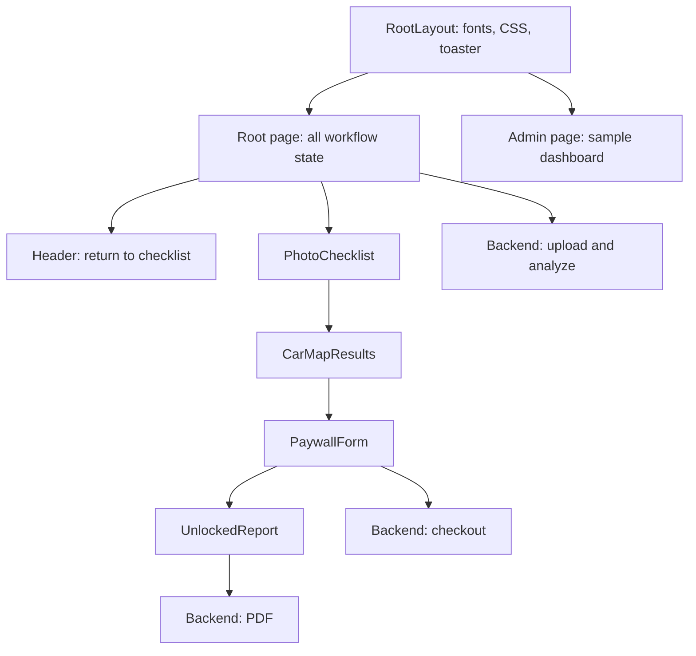

# CarsInsure frontend: implementation and maintenance guide

Responsive browser follow-up: see [RESPONSIVE_AUDIT.md](RESPONSIVE_AUDIT.md) for the 2026-09-14 desktop/tablet/mobile review. **2026-09-14 (follow-up):** PhotoChecklist updated — Camera button is now hidden on desktop via `useHasCamera` (MediaDevices API); see R7 fix note in RESPONSIVE_AUDIT.md.

Analyzed: 2026-09-14. Scope: local application source, configuration, dependencies and assets. This is a static analysis; runtime/browser behavior and external services were not tested. See [backend analysis](../backend/BACKEND_ANALYSIS.md) for routes, persistence and AI behavior.

## Using this guide later

Read the change-location table first, then inspect only the affected source and shared contracts. Consecutive line ranges below cover every line in the application text files, with adjacent JSX, comments and closing delimiters grouped by purpose. They are not a duplicated source listing. Line numbers describe this snapshot; use the function names after edits move them.

Update affected sections and fingerprints with each change. Fingerprints identify changed files so unchanged code does not need another full analysis. Generated output, third-party code, binary images and base64 image bytes are inventoried rather than explained as program logic. Environment values are not copied.

## Architecture and routes

This is a JavaScript Next.js App Router frontend, not a plain React/Vite app. It has its own Git repository/package manifest, separate from the backend. `/` is a client-side four-step interface controlled entirely by React state. `/admin` is a separate public route with hardcoded dashboard data.

Steps are `checklist`, `results`, `paywall`, `unlocked`; they are not separate URLs. Refresh loses photos, user information, inspection ID and results. Clicking the header returns to checklist but does not clear state. There is no localStorage, session restoration, authentication provider, Redux store or frontend API route.

## Files, dependencies and setup

| File | Responsibility |
| --- | --- |
| `src/app/page.js` | Workflow controller, compression, upload and analysis network calls. |
| `src/app/layout.js` | Root HTML/body, Geist fonts, metadata and global Sonner toaster. |
| `src/app/globals.css` | Tailwind import, colors/font variables and body defaults. |
| `src/app/admin/page.js` | Public mock admin dashboard. |
| `src/components/Header.jsx` | Branding and checklist navigation. |
| `src/components/PhotoChecklist.jsx` | Fourteen photo cards, camera/gallery selection and demo fill. |
| `src/components/CarMapResults.jsx` | Three preview cards, all-findings SVG pins, photo overlay and paywall CTA. |
| `src/components/PaywallForm.jsx` | Name/email form and simulated checkout request. |
| `src/components/UnlockedReport.jsx` | Full finding cards, image overlay, PDF opening and verification display. |
| `src/components/demoPhotoData.js` | Single exported embedded PNG data URL; both demo buttons reuse it in all fourteen slots. |
| `public/demo/damaged_front_bumper.jpg` | Separate demo JPEG asset; current source does not reference this path. |
| `public/file.svg`, `globe.svg`, `next.svg`, `vercel.svg`, `window.svg` | Starter assets not referenced by current application components. |
| `src/app/favicon.ico` | App icon binary. |
| `package.json`, `package-lock.json` | Package scripts/declarations and exact npm dependency resolution. |
| `next.config.mjs` | Empty Next configuration object with default export. |
| `jsconfig.json` | Alias `@/*` to `./src/*`. |
| `postcss.config.mjs` | Enable `@tailwindcss/postcss`. |
| `.env.local` | `NEXT_PUBLIC_API_URL`; public backend base URL, never a secret. |
| `.gitignore` | Excludes dependencies, Next/build/test output, environment files, logs and specified tool metadata. |
| `README.md` | Starter Next instructions; refers to `app/page.js`, while this project uses `src/app/page.js`. |
| `AGENTS.md`, `CLAUDE.md` | Next agent instructions; CLAUDE points to AGENTS. Read installed Next docs before code edits as required by AGENTS. |
| `.next/`, `node_modules/`, `.git/` | Generated Next output, installed dependencies and Git metadata. Not application source. |

Manifest versions: Next `16.3.0`, React/React DOM `19.2.8`, lucide-react `^1.44.0`, Sonner `^2.0.8`, clsx `^2.1.1`, tailwind-merge `^3.6.0`, Tailwind/PostCSS plugin `^4`. Icons are Lucide and notifications are Sonner. `clsx` and `tailwind-merge` are not imported by the current source. No shadcn component library is installed despite a dashboard comment mentioning shadcn.

From this folder run `npm ci`, then `npm run dev` (default local URL `http://localhost:3000`). Production commands are `npm run build` and `npm start`. No test/lint scripts are declared. Set `NEXT_PUBLIC_API_URL` to the backend base URL; every current call site falls back to `http://localhost:5000`. As a public build setting, it must be correct for the built client. Layout uses `next/font/google`; consider font fetching when investigating build connectivity.

## State and end-to-end data flow

| State in `src/app/page.js` | Initial value | Readers/writers |
| --- | --- | --- |
| `currentStep` | `checklist` | Root renders selected child; header/results/paywall change it. |
| `vehicleData` | Empty company/makeModel/plateNumber; inspectionType `pickup` | Sent to backend and results; checklist receives setter but renders no vehicle-detail inputs. |
| `photos` | Keys `01`–`14`, all null | Upload handler stores `{url,filename}`; demo buttons store strings; passed to reports for image lookup. |
| `userInfo` | Empty name/email | Controlled paywall fields; unlocked email display. |
| `isProcessingPayment` | false | Paywall disables submit during request. |
| `isUploading` | false | Shared upload/analysis activity flag; disables analyze button. |
| `activeInspectionId` | null | Set from analysis response; used in checkout/PDF. |
| `analysisResults` | null | Receives `fullResults`; preview and full report use `findings`. |
| `capturedCount` | Derived truthy photo count | Checklist count, progress and remaining warning. |

1. A camera/gallery file is read with FileReader, decoded into Image and drawn onto canvas. Longest dimension is reduced to at most 1280; JPEG output quality is 0.7.
2. The original file is also sent as multipart field `photo` to `/api/upload`. State stores the compressed data URL, not the returned backend upload URL. Network/JSON failure still stores the data URL locally.
3. Analyze accepts at least one nonempty photo despite the fourteen-angle guidance. It sends `{vehicleData,photos}` as JSON to `/api/inspection/analyze`.
4. On `data.success`, save `inspectionId` and `fullResults`, then show results. Failure shows a toast and leaves the current step.
5. Results renders the first three cards but SVG markers for every finding. All results already exist in client memory before checkout.
6. Paywall submits `{inspectionId,name,email,amount:3.00}`. It ignores response status/body and always switches to unlocked in `finally`, even on failure or absent ID.
7. PDF button opens `/api/reports/{id}/pdf` in a new tab and immediately shows a success toast. It does not confirm that the PDF loaded.

## Complete source walkthrough

### `src/app/page.js` (201 lines)

| Lines | Explanation |
| --- | --- |
| 1–10 | Client directive, React/toast imports and five child imports. |
| 11–36 | App function and all workflow state listed above. |
| 37–48 | `compressImage` promise, FileReader/Image setup and 1280 max dimension. |
| 49–58 | Preserve aspect ratio while shrinking large images. |
| 59–71 | Canvas draw, JPEG data URL resolution, FileReader invocation; no reader/image error rejection handlers. |
| 72–82 | `handleFileUpload` checks file, sets loading, compresses and constructs multipart original file. |
| 83–96 | POST upload, parse JSON, retain compressed URL and filename, show success. Does not check `res.ok` or `data.success`. |
| 97–108 | On fetch/JSON failure store local photo anyway; outer error only logs; finally clears loading. |
| 109–119 | Analyze validates at least one photo, sets loading/toast and selects API base. |
| 120–130 | POST analysis JSON, parse response and transition to results on success. |
| 131–141 | Toast API/server errors; clear loading. |
| 142–153 | Derive captured count, render shell, header and main. |
| 154–168 | Checklist props and step condition. |
| 169–178 | Results props and step condition. |
| 179–189 | Paywall props and step condition. |
| 190–201 | Unlocked report props, close root markup/function. |

### `src/components/PhotoChecklist.jsx` (updated 2026-09-14)

| Lines | Explanation |
| --- | --- |
| 1–4 | `'use client'` directive, React/hooks and Lucide icon imports (`Camera`, `Image`, `Check`, `AlertTriangle`, `Sparkles`, `ChevronRight`). |
| 5–21 | `useHasCamera` hook: calls `navigator.mediaDevices.enumerateDevices()` on mount; returns `true` only when a `videoinput` device is found. Falls back to `false` on API absence or error. |
| 22–49 | `ANGLES` module-level constant — fourteen angle descriptors; no longer inlined inside JSX. |
| 50 | `DEMO_PHOTOS` constant derived from `ANGLES`; both demo buttons share this single object. |
| 51–59 | Component signature and derived values (`hasCamera`, `progress`). |
| 60–82 | Header banner with decorative blur circle, protocol badge, title, description and demo button. |
| 83–107 | Progress row: heading, device-aware subtitle, animated gradient progress bar pill. |
| 108–115 | Remaining-angle warning; uses pluralization for clean grammar. |
| 116–194 | Fourteen-tile grid via `ANGLES.map`. Each tile: two hidden inputs, header badge row, image/placeholder body, action bar. |
| 163–182 | Action bar: Camera label conditionally rendered only when `hasCamera` is true; grid switches `grid-cols-2` ↔ `grid-cols-1` accordingly. Gallery label label text adapts to "Upload Photo" on desktop. |
| 195–212 | Footer: demo fill button and Analyse Vehicle button with `ChevronRight` icon; disabled state uses softer slate-300 style. |

### `src/components/CarMapResults.jsx` (421 lines)

| Lines | Explanation |
| --- | --- |
| 1–7 | Client directive, imports and helper comment; several imports are unused. |
| 8–35 | `getUploadedPhotoSrc`: normalize multiple key formats, return first matching supporting image, otherwise first uploaded photo or null. |
| 36–75 | `getSanitizedVehiclePart`: angle label catalog; force windshield/hood for 02; replace misplaced wheel/rim labels; normally return slot label before raw part text. |
| 76–86 | Props, findings default, modal state and outer shell. |
| 87–107 | Conditional modal header, description, coordinate text and close button. |
| 108–128 | Object-contain image in fixed 4:3 container; overlay percentages from normalized box, badge. |
| 129–150 | Modal close action and results heading/back button; total uses incorrect fallback `findings.length || 6`. |
| 151–160 | Two-column responsive shell, inspection summary and SVG wrapper; summary also falls back to six. |
| 161–208 | Draw static SVG vehicle shell, cabin, glass, lights, mirrors, wheels and cutlines in `0 0 220 440` coordinates. |
| 209–223 | Iterate ALL findings; read part/description/type, first supporting image and first box center. |
| 224–242 | Infer vehicle side from text first, then photo angle and box center. Some comments/angle tests do not match the fourteen-angle catalog. |
| 243–300 | Assign SVG pin coordinates by part keywords (bumpers, hood, glass, trunk, roof, fender, door, wheel, mirror); unknown parts use central/side defaults. |
| 301–307 | Offset odd-index pins and select severity color; this is a simple offset, not collision detection. |
| 308–353 | Render clickable numbered pins, select photo/first box for modal, close SVG and show legend/vehicle fallback text. |
| 354–399 | Show only first three findings as cards with photo, sanitized part, type, confidence, severity and modal trigger. |
| 400–421 | Full report CTA, findings count and $3 paywall transition; close component. |

### `src/components/PaywallForm.jsx` (133 lines)

| Lines | Explanation |
| --- | --- |
| 1–23 | Client/imports, props, card and form heading. |
| 24–41 | Async submit prevents default, sets processing, conditionally POSTs ID/contact/3.00 amount. |
| 42–50 | Log errors, always clear processing and advance to unlocked; never consume checkout JSON. |
| 51–62 | Required controlled full-name input. |
| 63–75 | Required controlled email input. Browser validation only. |
| 76–83 | $3.00 price and verification-link copy. |
| 84–111 | Gateway buttons are visual only; no selected gateway state or handlers. |
| 112–116 | Security/provider claim text; backend has no gateway integration. |
| 117–133 | Disabled/processing submit button and closing markup. |

### `src/components/UnlockedReport.jsx` (224 lines)

| Lines | Explanation |
| --- | --- |
| 1–7 | Client directive, React/icons/toast imports and helper comment. |
| 8–35 | Duplicate supporting-photo resolver from results component. |
| 36–70 | Similar but different sanitization helper: rewrites some wheel labels; otherwise prefers backend part text. Can differ from preview labels. |
| 71–74 | Props, findings default and modal state. |
| 75–83 | Download picks active ID, result ID or `INS-DEMO`; opens backend PDF and immediately toasts success; outer report shell. |
| 84–132 | Photo modal with first/default box and same percentage overlay/4:3 geometry as preview. |
| 133–157 | Unconditional payment-verified/$3.00/emailed banner and PDF button. No email delivery confirmation exists. |
| 158–171 | Findings heading uses incorrect `findings.length || 9` fallback; count badge uses actual count. |
| 172–216 | Every finding gets thumbnail, part, severity, confidence, description and first/default-box overlay trigger. |
| 217–224 | Hardcoded purported verification hash and signed label, closing markup/function. |

### Remaining application files

| File / lines | Explanation |
| --- | --- |
| `Header.jsx` 1–5 | Client/import and component accepting step setter. |
| `Header.jsx` 6–12 | Sticky header branding; clickable div resets step to checklist without clearing data. |
| `Header.jsx` 13–22 | Inspection badge and closing markup. `xs:` usage has no custom breakpoint definition in current theme. |
| `demoPhotoData.js` 1 | Export `DAMAGED_CAR_PHOTO` as embedded PNG; bytes are asset data, not inspection logic. |
| `layout.js` 1–13 | Import global CSS/toaster and configure Geist sans/mono variables. |
| `layout.js` 14–18 | Static page title and description metadata. |
| `layout.js` 19–32 | Root HTML/body, children and top-right rich-color closable toaster. |
| `globals.css` 1–7 | Tailwind import and light background/foreground variables. |
| `globals.css` 8–14 | Inline theme maps color/font tokens to CSS variables. |
| `globals.css` 15–21 | OS dark preference overrides root colors. |
| `globals.css` 22–26 | Body colors and Arial/Helvetica font fallback; page-level light classes override much of the dark theme. |

### `src/app/admin/page.js` (342 lines)

| Lines | Explanation |
| --- | --- |
| 1–17 | Client/imports, local `adminTab` and `searchTerm`, responsive dashboard shell. No authentication check. |
| 18–28 | Sidebar and sample branding. |
| 29–61 | Map overview/inspections/users/revenue tab buttons; clicking only changes local state. |
| 62–78 | Settings navigation and sidebar group closing markup. |
| 79–93 | Static admin identity; logout icon is simply a link to `/`. |
| 94–124 | Main header, controlled search box, decorative notification and link back to app; search does not filter data. |
| 125–139 | Conditional overview/title and Customize Layout button without handler. |
| 140–198 | Four fixed statistic cards; numbers are not fetched/aggregated. |
| 199–238 | Static SVG trend curve and date-range buttons without handlers. |
| 239–298 | Three hardcoded inspection rows; Refresh Queue has no handler, View PDF only calls alert. |
| 299–306 | Inspections placeholder tab. |
| 307–314 | Users placeholder tab. |
| 315–322 | Revenue placeholder tab. |
| 323–342 | Settings price defaults to 3.99; Save only alerts, no persistence or effect on checkout. Close dashboard. |

## Shared API and image contracts

| Call site | Backend route | Consumed behavior |
| --- | --- | --- |
| Root `handleFileUpload` | POST `/api/upload` | Multipart original file; consumes filename only, retains compressed data URL. |
| Root `handleAnalyzePhotos` | POST `/api/inspection/analyze` | Sends vehicleData/photos; consumes success/error/inspectionId/fullResults. Ignores separate summary/previewFindings. |
| Paywall submit | POST `/api/payment/checkout` | Sends ID/contact/amount; consumes no response fields. |
| Unlocked `downloadPdf` | GET `/api/reports/:id/pdf` | Opens new tab. |

No frontend caller exists for OCR or health; no admin/history/settings API exists in this source.

| Photo key / supporting ID | Intended angle |
| --- | --- |
| `01` / `IMAGE_01` | Direct front bumper, grille and headlights |
| `02` / `IMAGE_02` | Windshield and hood |
| `03` / `IMAGE_03` | Front-left corner |
| `04` / `IMAGE_04` | Driver/left profile |
| `05` / `IMAGE_05` | Rear-left corner |
| `06` / `IMAGE_06` | Rear face |
| `07` / `IMAGE_07` | Rear windshield |
| `08` / `IMAGE_08` | Rear-right corner |
| `09` / `IMAGE_09` | Passenger/right profile |
| `10` / `IMAGE_10` | Front-right corner |
| `11` / `IMAGE_11` | Front-left wheel |
| `12` / `IMAGE_12` | Rear-left wheel |
| `13` / `IMAGE_13` | Rear-right wheel |
| `14` / `IMAGE_14` | Front-right wheel |

Photo values may be null, a string URL/data URL, or `{url,filename}`. Finding fields used by the UI are `finding_id`, `vehicle_part`, `damage_type`, `severity`, `confidence`, `supporting_images`, `bounding_boxes`, and `description`. Expected box order is `[ymin,xmin,ymax,xmax]`, normalized 0–1000. CSS top/left are ymin/xmin divided by ten percent, width/height are coordinate differences divided by ten percent.

Both overlays position against the container, not the actual letterboxed image rectangle. Non-4:3 photos can therefore show misaligned boxes. Both choose the first box independently from the photo resolver, which may select another supporting photo or fallback image. Missing boxes get invented coordinates. If changing evidence display, match `bounding_boxes[].image_id` to the displayed photo and account for rendered image offsets.

## Where to make common changes

| Request | Primary files | Related changes |
| --- | --- | --- |
| Branding/title/colors | Header, layout, globals.css | Most colors/layout utilities are inline across components and admin. |
| Add vehicle form or OCR | PhotoChecklist, root vehicleData | Backend OCR currently fixed sample data; successful AI branch needs vehicle-info assignment. |
| Change photo protocol/count | Root photo keys and checklist catalog/demo/counts | Both report helpers, SVG placement and backend prompt/maps/fallbacks. |
| Compression/payload limits | Root `compressImage`/upload/analyze | Original multipart file is still uncompressed; backend/hosting limits are independent. |
| Analysis errors/loading | Root handlers, checklist button | Backend must distinguish real AI results from synthetic fallback. |
| Finding labels/photo evidence | CarMapResults and UnlockedReport helpers | Backend angle correction and box schema. |
| Car diagram/pin locations | CarMapResults SVG and finding map | Explicit corner names currently often fall through keyword mapping. |
| Price/payment flow | PaywallForm, results CTA, unlocked banner | Backend amount enforcement/gateway verification; admin 3.99 is unrelated mock value. |
| PDF content | Backend PDF handler | UnlockedReport only opens URL. |
| Save/reload inspections | Root state and new history/loading flow | Backend currently lacks a report JSON read/list API and reads only memory. |
| Real admin dashboard | Admin page | Add authenticated backend reads/settings persistence first. |
| Shared API client/helpers | Four API call sites and duplicate photo/label/modal logic | Keep existing input shapes or update both sides together. |

## Observed limitations and misleading demo behavior

- Empty findings display six in parts of preview and nine in unlocked heading because `0 || fallback` selects the fallback. Cards still render zero.
- The fourteen-angle checklist accepts one image; demo repeats one image fourteen times. Guidance is not input validation.
- Compression reduces dimensions/quality but does not enforce total request bytes, despite its payload-limit comment. Original upload can still be large. Reader/image errors can leave the promise unresolved; concurrent uploads share a single Boolean loading flag.
- Vehicle inputs and OCR intake are absent despite root state/comments suggesting them.
- Paywall is a presentation step, not access control: all results already arrived; checkout failure still unlocks; backend does not require paid status for PDF.
- Payment/email/signature/verification-link claims are not backed by integrations. The displayed hash is hardcoded and checkout response metadata is discarded.
- Admin counts, transactions, graphs and settings are sample data; no authentication or persistent settings exists.
- Photo fallback and mismatched first boxes can show unsupported evidence. Confidence expressions using `||` replace a valid zero with a positive default.
- Modal controls have no implemented Escape handling/focus trap; several clickable spans/divs/SVG elements lack keyboard button semantics. These are source observations, not a complete accessibility audit.

## Validation and upkeep

For this documentation task, all listed application text files were read and line ranges checked; no runtime code was changed and no browser/build/API test was run. No external AI or payment requests were made.

After future UI changes, check the affected flow: empty/one/fourteen photos, upload failure, corrupt image, successful and rejected analysis, zero/many findings, portrait/landscape overlays, checkout failure, PDF availability, back navigation and refresh. For admin work, verify data actually changes and is persisted rather than relying on existing alerts. Run `npm run build` for meaningful application-code changes; consult installed Next docs per AGENTS before editing code.

Update this guide with changed source and cross-update the backend guide for API/schema/payment/photo-protocol changes. Unchanged fingerprints allow skipping unchanged files, while changed files and their direct dependencies still need focused review.

## Snapshot fingerprints

SHA-256 of raw file bytes at analysis time (including line endings). These are documentation freshness checks, unrelated to the application report signature. Environment files and mutable customer/upload data are excluded. Run `Get-FileHash -Algorithm SHA256 <path>` from this folder to compare a file; a mismatch calls for reviewing that file and updating its affected documentation.

| File | SHA-256 |
| --- | --- |
| `src/app/page.js` | `53eacb0ec86943c2128dd09c7703cb0c3175be408e10d2bedf46fd68b7bcbb9f` |
| `src/app/layout.js` | `8677bbb6fbab751ad1eea8dcfa2cc42920c29da792cd751a1330789cd8289405` |
| `src/app/globals.css` | `94d307fb925a3264dd331975b5e17170b1d887f361669cf839bdf37cc7a40db8` |
| `src/app/admin/page.js` | `9efae8d4944e2b743cdca45a0f87ba076096557bc0f24f99fb08d17bf9305b04` |
| `src/components/Header.jsx` | `f38bd266bf66aa4762890918d14e1c3859b5828017a4d081caa40668d4e177a5` |
| `src/components/PhotoChecklist.jsx` | `0c004bcfffc42c80d6014531a34ea0cfb2fdf3f0587573098b56d89cb57c2f44` |
| `src/components/CarMapResults.jsx` | `a0fad896001527a12eee7fc3e8f292988f2a08cc5058f26b2b26a028b300756c` |
| `src/components/PaywallForm.jsx` | `c44c46ff948841e816c3fa126e63a651974da373017c7ce83556f8f1843cd49b` |
| `src/components/UnlockedReport.jsx` | `64cd02391bb4623bb801582d20cccee6e7e9b27513765f9e7354fc590d77aec3` |
| `src/components/demoPhotoData.js` | `ee0041405302e72d748aa994eda43ec1f8ec482a9946e37b565a4b0d2fa3e48e` |
| `package.json` | `8939f1569d84a9b2f03c380bf20066c6a0ab31929021b7aad417ed5fad186e00` |
| `package-lock.json` | `45e18cbf02c69b8b42cdc56db945f4a12c5d6ee69b666faa67db63f23a1d7da1` |
| `next.config.mjs` | `3247bde2f4912a3602f2175f171d9bab44b78ba61d5da662052da8545374a5dc` |
| `jsconfig.json` | `f03487a8bec8e2eb501a26c6881abdeed01bedad604ba0d5d96d5d5bf23e155c` |
| `postcss.config.mjs` | `7b299d3d3b16699ddda397c0b2373b3af4f25f8fc9ccc9b3d9e64ef083bc1c21` |
| `.gitignore` | `cfdbd5a321f3ba279e434c025fc9a44bf2d3bd3a1af5affb8429d79bd18af054` |
| `AGENTS.md` | `ec1b6e023814ae1a510b02ea62229e5eb035d75e39e3335d5ea7f5ce5654d567` |
| `CLAUDE.md` | `d631d88045f74623d568adfb4783b72e3d1b732330d749bc6c72e6648d4581d3` |
| `README.md` | `f9bcd78f9848434b370469734c40c0d6a3b7c08d860a6dade620d08c6f6d8632` |
